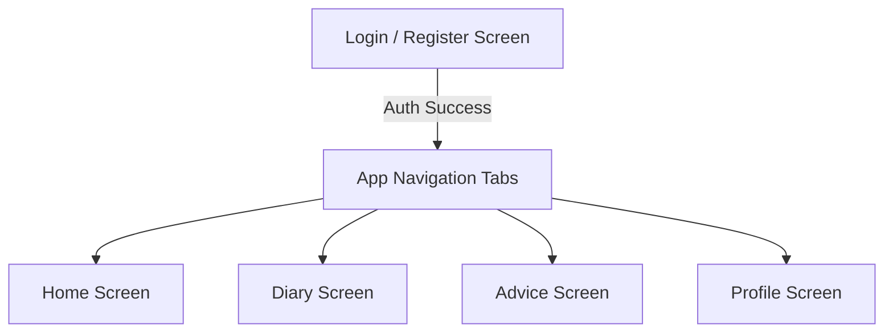

# SleepSense Mobile Screen & Redesign Guide

This document provides a comprehensive analysis of the mobile screens in the **SleepSense** prototype application, details their current logic and user flows, and provides a design specifications guide to help you perform a premium UI/UX redesign using **Google Stitch** (with a structured `DESIGN.md` specification).

---

## 1. About the Project: SleepSense Mobile

**SleepSense** is an AI-driven behavioral health platform. The mobile application functions as a passive telemetry and subjective journal logger that works alongside a machine learning backend to predict night-to-night sleep quality scores.

### Core Architecture & Technical Stack
* **Framework**: React Native (built using Expo Go and compatible with EAS builds).
* **Navigation**: Bespoke Tab-based navigation system in [App.js](file:///c:/Users/HP/Desktop/Semester%207/AI/Project/SleepSense-mobile-app/App.js) guarding the Home, Diary, Advice, and Profile screens.
* **Database & Persistence**: Local secure encryption storage (`SecureStore` via `expo-secure-store`) for session tokens, profile parameters, and offline telemetry tracking.
* **Passive Telemetry**: Real-time listeners on `AppState` in [App.js](file:///c:/Users/HP/Desktop/Semester%207/AI/Project/SleepSense-mobile-app/App.js) to monitor background-to-foreground transitions and count phone usage/locks in three distinct buckets: daytime, evening, and late-night.
* **Server Communication**: Axios-driven client connected to a GCP Cloud Run FastAPI backend hosted at:
  `https://sleepsense-api-656306996421.us-central1.run.app`

---

## 2. Active Screens Catalog & Analysis

The mobile client is composed of **five core screens** inside `src/screens/`:



### 1. Login & Registration Screen (`LoginScreen.js`)
* **Purpose**: User onboarding, identity management, and server settings configuration.
* **Key Functionalities**:
  * **Dual Flow**: Toggles between standard Login and Account Registration (includes inputting pre-study PSQI score).
  * **Google OAuth**: Integrated with `expo-auth-session/providers/google` requesting credentials for social authentication.
  * **Dynamic Server Configuration**: A gear icon (⚙️) triggers a hidden modal letting developers customize the API base URL. This is crucial for local testing across physical devices over the same Wi-Fi connection.
* **Current UI Layout**:
  * Dark indigo card overlaying a midnight background.
  * Input text fields with deep grey borders.
  * Primary indigo color button for submission, alongside a secondary borderless Google Sign-In button.

### 2. Home Dashboard Screen (`HomeScreen.js`)
* **Purpose**: The primary landing pad showing predicted sleep quality, diary status, and daytime habits.
* **Key Functionalities**:
  * **User Identity Greeting**: Welcomes the user with their email prefix and checks for their Google profile picture (with an initial fallback).
  * **Diary Quick-Log Reminder Banner**: A color-coded widget showing whether today's diary is incomplete (indigo warning) or complete (green checklist). Tapping redirects to the Diary tab.
  * **Sleep Quality Gauge**: Renders `Gauge.js` (an SVG-based circular indicator) representing the expected sleep score percentage (0% - 100%) mapped from the backend's continuous prediction.
  * **Daytime Activity Summary Grid**: Displays four cards with quick activity insights (Phone Unlocks, Walking Minutes, Quiet Environment Ratio, and Daily Routine Flag).
  * **Anomaly Warning Alert**: If the backend detects a behavioral anomaly (`anomaly_flag === 1`), a warning banner details that tonight's sleep prediction is adjusted for unusual routine shifts.
  * **Sleep Coach Advice Preview**: Extracts the highest-priority coaching item from the latest backend prediction and previews it with a redirect link to the Advice tab.

### 3. Subjective Diary Screen (`DiaryScreen.js`)
* **Purpose**: Capturing Ecological Momentary Assessment (EMA) variables and journal notes.
* **Key Functionalities**:
  * **Mood & Stress Star Selector**: Lets users rate happy, stress, and tired levels (1-5 numeric grid buttons).
  * **Daily Lifestyle Numeric Inputs**: Inputs for social contacts, study/work hours, and workout checkbox.
  * **Tonight's Sleep Journal Notebook**: Multi-line textbox allowing users to write natural language notes (e.g., "drank coffee at 4pm").
  * **Submission Merging**: Combines local passive telemetry (unlock counts, first/last usage hours) with subjective ratings and pushes them to the `/predict/{userId}` endpoint.

### 4. Sleep Coach Advice Screen (`AdviceScreen.js`)
* **Purpose**: Providing model explainability (SHAP drivers) and actionable coaching guidelines.
* **Key Functionalities**:
  * **SHAP Drivers Visualization**: Dynamically displays sleep drivers returned by the backend. It maps technical feature names (e.g. `unlock_count_late_night`) to friendly terms (e.g. "Late-night screen pickups") and uses color-coded horizontal bars:
    * **Helps Sleep (Green 👍)**: Positive SHAP values.
    * **Sleep Disruptor (Red ⚠️)**: Negative SHAP values.
  * **Dynamic Value Formatting**: Decodes numeric values (like converting `22.8` hours to `10:48 PM`).
  * **Sleep Recommendations**: Renders a vertical feed of tailored coaching advice to improve sleep quality.

### 5. Profile & Settings Screen (`ProfileScreen.js`)
* **Purpose**: User configuration overview, study statistics, and session termination.
* **Key Functionalities**:
  * **User Card**: Lists User ID and logs baseline pre-study PSQI score vs current post-study PSQI.
  * **Big Five Personality Traits**: Lists the user's Extraversion, Agreeableness, Conscientiousness, Neuroticism, and Openness scores.
  * **Network Status**: Displays the current connected backend URL.
  * **Logout Action**: Securely purges the JWT token, userId, and profile image from the client's storage.

---

## 3. Stitch Redesign Plan

To redesign the application using **Google Stitch** (the AI-native layout canvas), you can feed it this `DESIGN.md` layout specification. Stitch parses these design token mappings to generate clean, modern glassmorphic designs.

### Google Stitch System Config (`DESIGN.md`)

```markdown
# SleepSense Brand Redesign Tokens

## 1. Color Palette (Dark Theme Mode)
*   --bg-base: #080A11 (Ultra deep obsidian background)
*   --bg-card: rgba(22, 26, 43, 0.65) (Translucent navy blue)
*   --bg-card-border: rgba(255, 255, 255, 0.08) (Soft glassmorphic highlights)
*   --color-primary: #818CF8 (Vibrant Indigo accent)
*   --color-primary-glow: rgba(129, 140, 248, 0.15) (Aura glow for active tabs)
*   --color-accent-emerald: #10B981 (Active status / Helps sleep)
*   --color-accent-amber: #F59E0B (Moderate warning / Fair sleep)
*   --color-accent-rose: #EF4444 (Alert warning / Sleep disruptors)
*   --color-accent-pink: #EC4899 (Routine anomalies)
*   --text-main: #F8FAFC (Pure snow white)
*   --text-muted: #94A3B8 (Cool slate grey)

## 2. Typography
*   --font-heading: "Outfit", sans-serif (Soft, modern, premium sans-serif)
*   --font-body: "Inter", sans-serif (Highly readable UI font)
*   --weight-regular: 400
*   --weight-medium: 500
*   --weight-semibold: 600
*   --weight-bold: 700

## 3. Layout, Shadows & Glassmorphic Blur
*   --card-radius: 20px (Organic rounded corners)
*   --input-radius: 12px
*   --button-radius: 14px
*   --blur-heavy: 20px (React Native backdrop-filter simulation)
*   --shadow-premium: 0 10px 30px rgba(0, 0, 0, 0.5)
```

---

## 4. Redesign Actions: Screen-by-Screen Layout Guide

Here are instructions to give Google Stitch or follow during the manual screen redesign:

| Screen | Current Screen Layout | Planned Redesign Actions | Visual Details to Implement |
| :--- | :--- | :--- | :--- |
| **Login Screen** | Standard opaque card input box. | Transformed into a floating **Glassmorphic Login Panel**. | * Background: Translucent frosted glass effect using `rgba` colors and thin boundaries.<br>* Brand Header: Use large `Outfit` typography, centered with a subtle neon glowing brand logo.<br>* Google Login Button: Unified pill button featuring a clean, modern vector logo. |
| **Home Dashboard** | Simple cards grid, circle SVG gauge. | **Gradient Ring Gauge & Neumorphic Activity Hub**. | * Sleep Score Gauge: Replace solid circle progress with a dual-layer premium gradient arc (e.g. indigo-to-emerald gradient) that lights up based on score.<br>* Activity Grid: Design cards as interactive tiles featuring glowing mini-indicators, subtle drop-shadows, and micro-animations on hover/tap. |
| **Diary Screen** | Plain input rows, standard slider switches. | **Immersive Lifestyle Log Card Stack**. | * Star Rating Selector: Upgrade plain numbered squares into a styled horizontal row of neumorphic buttons.<br>* Journal Text Box: Clean translucent text-area with active state border glow.<br>* Exercise Toggle: Styled custom switcher with animatable slider ball. |
| **Advice Screen** | Technical metrics with basic progress bars. | **Interactive Driver Charts & Coaching Feed**. | * SHAP Drivers: Replace simple progress lines with two-sided horizontal charts displaying positive influences (emerald bars) and negative influences (rose bars) on either side.<br>* Advice Recommendations: Clean card container with colored border highlights. |
| **Profile Screen** | Vertical text tables. | **Modern Health Statistics Dashboard**. | * User Card: Clean grid system dividing baseline scores.<br>* Big Five Personality: Render as a modern 5-axis visual polygon chart (radar grid) or neat circular dial rings instead of a plain text table.<br>* Server URL: Styled as a chip badge with copy-to-clipboard feedback. |

---

### Step-by-Step Instructions for Redesigning the Code
1. **Update `src/theme/colors.js`**: Replace base values with the ultra-modern Obsidian and Translucent Navy variables (`#080A11`, glass border weights).
2. **Refactor Components**: Wrap card containers with custom translucent styles.
3. **Enhance `Gauge.js`**: Update SVG path coordinates to render a modern open-arc gauge with color gradients instead of a closed full circle.
